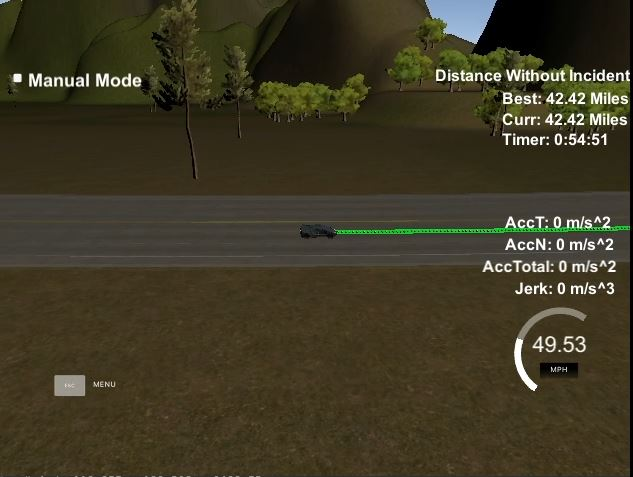

# Model Documentation

Here is a [video](video.avi) of the car driving for one hour withour any incidents. To spare GitHub space only the last 10 minutes is uploaded.

The code tries to follow [Google's C++ style guide](https://google.github.io/styleguide/cppguide.html). There might be some deviations as I am used to radically different styles.

## Features
The current solution works as follows:
- The car accelerates to the the preferred 49.4 mph speed.
- It checks the lane speed of neigbouring lanes if it catches up a slower car.
- It checks if the faster lanes have and will have enough free space to switch into it.
- It switches lane to the faster lane if possible, slows down otherwise.

The image is showing the car running for 42 minutes (in 54 minutes) without any incidents:

## Structure
More important files, classes, and structs:
- `main.cpp` was modified to support both Linux and Windows via uWS
- `config.h` contains all hard limits and major tuning parameters
- `Map` loads and stores map data
- `EgoCar` the ego car's sensor fusion data as received from the simulator. All values are converted to SI units (meters per second and radians).
- `PrevPathFromSim` trajectory received back from the simulator
- `SensorFusion` high level information on traffic and lanes
- `SFCar` sensor fusion data for non-ego cars
- `SplineDef` data and methods for defining a spline for tk::spline
- `TrajectoryBuilder` creates trajectories

Only a `Map` and a `BehaviorPlanner` class instance exist from the program start to its end. All other class instances have a lifetime of one frame or less.

## Behavior Planner
A finite state machine with the following states:
- **keep lane**: checks for faster lanes if certain security measures are met and initiates lane changes
- **go left** and **go right**: the car stays in the state until the change is finished. A lane change is considered finished when the car is closer to lane center than 0.4 meters. Then it switches back to keep lane state.

Security measures:
- The car doesn't start a lane change if it is slower than the car in front. This usually happens when the PD controller temporarily slows the ego car down. Lane change in this phase would be dangerous, as fast cars might be arriving in the target lane.
- Slow down a tiny bit before lane switch to keep more space to the cought-up car.
- Don't start lane change if the front car is too close.
- Don't start lane change if speed is below 6 meters per second to avoid spending too much time between lanes.

The BehaviorPlanner instantiates and uses SensorFusion and TrajectoryGenerator. See details below.

## Sensor Fusion
Is is a high level sensor-fusion class. Notable methods:
- `GetCarInFront()` returns the ID of the car in front of the ego car, taking into account the circular nature of the map.
- `GetPredictedPos()` returns the predicted position of a car. Overloaded for ego and non-ego cars.
- `IsLaneOpen()` returns true if no predicted car positions get close to the predicted ego car positions, false otherwise.
- `SelectTargetLane()` contains the main logic for lane selection.
- `GetPredictedDistanceBeforeObstructed()` returns the distance where the ego car will catch up the closest car in a lane, taking into account the poses, speeds, and the circular nature of the map.

## Trajectory Generation
The `BehaviourPlanner` creates a `TrajectoryBuilder` instance every frame, storing references to the Map, EgoCar, and PrevPathFromSim instances. It sets up a reference pose that will be used later as a starting point and as a reference point for coordinate transformations.

Then it calls its `GetTrajectory()` method with parameters of `target_lane`, `front_car_dist`, and `front_car_speed`. It generates a trajectory from the ego pose to match these values. Its parts:
1. `InitOutput()` clears and reserves the output vectors.
2. `CopyPrevious()` calculates the number of nodes to keep and copies them to the output. Returns the number of nodes copied. Maximum 0.4 second worth of previous trajectory is kept and the other nodes are discarded, so that the car can react faster to traffic changes (compared to solutions where only a couple of nodes are appended to the very end of the trajectory).
3. `DefineSpline()` creates 3 `x` and `y` values and passes them to the tk::spline constructor. A spline can be created in the following ways:
   - From the ego pose: if there are no usable previous trajectory nodes
   - From the previous trajectory: using the last 3 nodes if
4. `Extend()` adds 3 more nodes the distance in the target lane to define a smooth spline. A tk::spline instance is returned. 
5. A displacement value is calculated with a PD controller.
6. The trajectory is filled with nodes in a `for` loop:
   - the `x` value is incremented by the displacement
   - the spline method call returns an `y` value for the `x`
   - the coordinate is transformed back from the Ref coordinate system (set in the ctr) and stored.

## Known limitations, possible next steps
- The car does not follow the keep right rule. Reasons:
  - It was not a requirement.
  - No other car follows that rule, thus following it would be contraproductive.
- Only the neigbouring lanes are considered for lane changes. Checking other lanes could be added.
- Cost functions could be added to improve the trajectory quality.
- A path-finding could be used to get out of situations where the ego car is closed in the right lane by another slow car in the center lane.
- A car suddenly changing lanes can cause a crash. To avoid this the following behaviours can be added:
  - When passing by a slower car move away by one lane if possible.
  - Otherwise slow down to a secure speed.
- Sensior fusion data is not available for cars that are changing lanes. No sensor data is available if the ego car changes lane. Possibilities: get better quality sensor data if possible. Otherwise extrapolate.

## Resources
- Integrating Vcpkg and more: https://www.codza.com/blog/udacity-uws-in-visualstudio
- Integrating uWs: https://github.com/danthe42/CarND-Path-Planning-Project/blob/master/src/main.cpp

## Dependencies
- tk::spline: https://kluge.in-chemnitz.de/opensource/spline/
- Eigen: http://eigen.tuxfamily.org/
- uWS: https://github.com/uNetworking/uWebSockets
- Vcpkg: https://github.com/Microsoft/vcpkg
